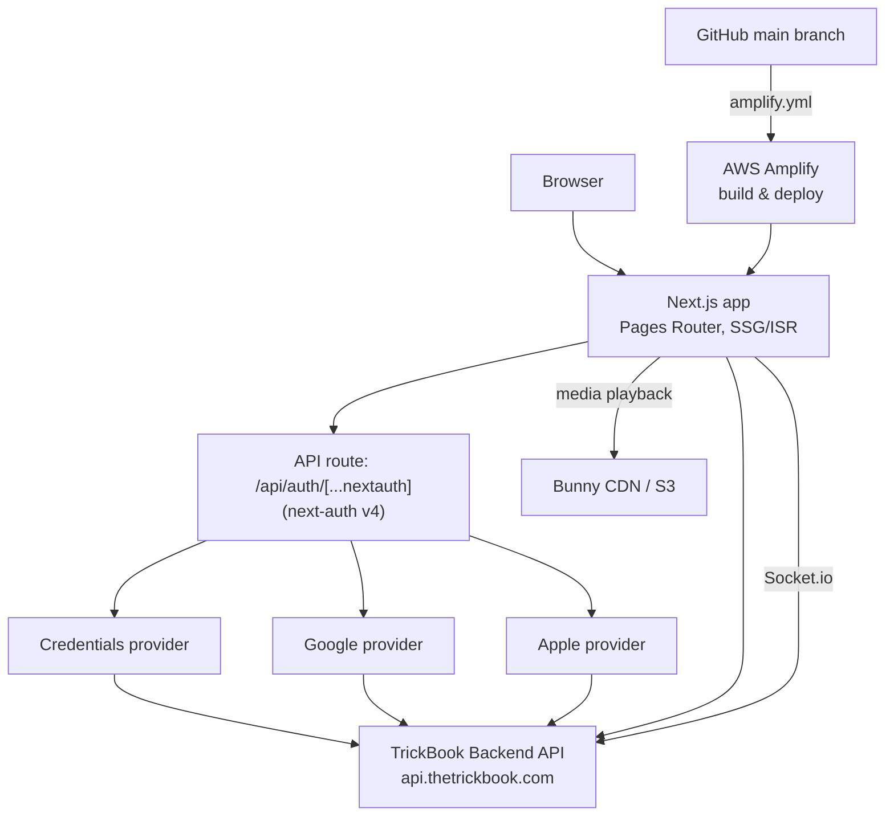

# TrickBook Website

The web frontend for **TrickBook** — a social platform for action sports, by riders, for riders. Live at [thetrickbook.com](https://thetrickbook.com).


## Overview

This is a Next.js app (**Pages Router**) that serves as both the marketing/content site and the user-facing web client for the TrickBook platform. All application data lives in the TrickBook backend API (`api.thetrickbook.com`); this app renders it, handles authentication via next-auth, and shares the same JWT auth strategy as the mobile app.

Feature areas (see `pages/`):

- **Blog** — ISR-rendered posts (`revalidate: 60`) fetched from the backend blog API, with SEO metadata, table of contents, and share actions.
- **Trickipedia** — encyclopedia of tricks organized by category (`/trickipedia/[category]`).
- **Spots** — skate spot discovery with a Google Maps view (marker clustering), browse-by-state pages, and user spot submissions.
- **TrickBook / TrickList** — trick tracking and personal trick lists (`/trickbook/my-lists`, `/tricklist`).
- **Messages** — real-time DMs and conversations via Socket.io.
- **Media & profiles** — video/media feeds (Bunny CDN + HLS playback, tus resumable uploads), user profiles, homies (friends), settings.
- **Admin dashboard** — content management for blog posts, Trickipedia entries, spots (including pending-spot moderation), categories, and analytics (`/admin`).
- **Auth pages** — login, signup, forgot/reset password.
- **Kaori Live** — experimental 3D VRM avatar page driven by a voice-service WebSocket (three.js + `@pixiv/three-vrm`).

## Architecture



Key points:

- The **only API route** in this app is the next-auth handler (`pages/api/auth/[...nextauth].js`). All other data access goes straight to the Express backend through the `lib/api*.js` client modules.
- OAuth sign-ins (Google/Apple) exchange the provider token with the backend (`/api/auth/google-auth`, `/api/auth/apple-auth`), which returns the platform JWT stored on the next-auth session — the same JWT scheme the mobile app uses.
- Blog and content pages use `getStaticProps`/`getStaticPaths` with 60-second ISR revalidation.

## Tech Stack

| Concern | Technology |
|---|---|
| Framework | Next.js 13.5 (Pages Router), React 18.2 |
| Auth | next-auth 4.24 (Credentials, Google, Apple providers) |
| Styling | Tailwind CSS 3.4 + MUI 5 (transitioning to Tailwind-first), Radix UI primitives, Bootstrap/react-bootstrap (legacy), next-themes for dark mode |
| Data fetching | axios clients in `lib/` against the Express backend |
| Real-time | socket.io-client |
| Maps | `@vis.gl/react-google-maps` + `@googlemaps/markerclusterer` |
| Video | Bunny Stream (HLS via hls.js, tus-js-client uploads) |
| Payments | Stripe (`@stripe/stripe-js`) |
| Analytics | PostHog, Google Analytics (`@next/third-parties`) |
| 3D | three.js + `@pixiv/three-vrm` (Kaori Live) |
| Lint/format | Biome (+ husky/lint-staged pre-commit hooks) |
| Testing | Playwright |

## Getting Started

**Prerequisites:** Node 20 (see `.nvmrc`; `engines` requires `>=20`).

```bash
nvm use                      # picks up Node 20 from .nvmrc
npm install
cp .env.example .env.local   # then fill in values (see below)
npm run dev                  # http://localhost:3000
```

The app expects the TrickBook backend running locally on port 9000 (or point `NEXT_PUBLIC_BASE_URL` / `NEXT_PUBLIC_API_BASE_URL` at another environment).

## Environment Variables

Names and purpose only — never commit real values. `.env.local` is gitignored; **production values are managed in the AWS Amplify console** (the Amplify build writes the allow-listed vars into `.env.production` during `preBuild`).

| Variable | Purpose |
|---|---|
| `BASE_URL` / `NEXT_PUBLIC_BASE_URL` | Backend API origin (e.g. local Express server or `https://api.thetrickbook.com`) |
| `NEXT_PUBLIC_API_BASE_URL` | Backend API base path (`<origin>/api`) |
| `NEXTAUTH_URL` | Canonical URL for next-auth callbacks |
| `NEXTAUTH_SECRET` | next-auth session/JWT encryption secret |
| `JWT_SECRET` | Shared JWT signing secret (must match backend) |
| `GOOGLE_CLIENT_ID` / `GOOGLE_CLIENT_SECRET` | Google OAuth provider |
| `APPLE_WEB_SERVICE_ID` | Apple SSO Services ID (client ID for Sign in with Apple on web) |
| `APPLE_TEAM_ID` / `APPLE_KEY_ID` / `APPLE_PRIVATE_KEY` | Used to mint the Apple client secret (ES256 JWT) at runtime |
| `NEXT_PUBLIC_GOOGLE_MAPS_KEY` | Google Maps JS API key (spots map) |
| `NEXT_PUBLIC_BUNNY_LIBRARY_ID` / `NEXT_PUBLIC_BUNNY_CDN_HOSTNAME` | Bunny Stream playback (public values) |
| `NEXT_PUBLIC_STRIPE_PUBLISHABLE_KEY` | Stripe publishable key |
| `NEXT_PUBLIC_POSTHOG_KEY` / `NEXT_PUBLIC_POSTHOG_HOST` | PostHog analytics |
| `NEXT_PUBLIC_GA_MEASUREMENT_ID` | Google Analytics measurement ID |
| `NEXT_PUBLIC_KITH_VOICE_WS_URL` | Kaori voice-service WebSocket URL |

See `.env.example` for the full documented template.

## Scripts

| Script | What it does |
|---|---|
| `npm run dev` | Start the dev server |
| `npm run build` | Production build (`next build`) |
| `npm start` | Serve the production build |
| `npm run lint` / `npm run lint:fix` | Biome check (read-only / auto-fix) |
| `npm run format` / `npm run format:check` | Biome formatting |
| `npm run validate` | Biome check + production build (CI-style gate) |
| `npm run test:blog-smoke` | Playwright blog smoke test |

Husky + lint-staged run Biome on staged files before every commit.

## Blog & Content Authoring

Blog content is **API-backed, not file-backed**: posts live in the backend database and are fetched through `lib/api.js` (`https://api.thetrickbook.com/api/blog`), then statically rendered with 60-second ISR. To publish or edit a post, use the **admin dashboard** (`/admin/create-blog-post`, `/admin/blog`) as an admin user.

The markdown files in `posts/` (read by `lib/posts.js` via gray-matter) are a legacy/local content path that is no longer wired into the blog pages — treat them as source-of-record drafts, not the publishing mechanism.

## Testing

Playwright smoke tests live in `tests/` (`playwright.config.js`):

```bash
npm run test:blog-smoke
```

The config auto-boots the dev server on `127.0.0.1:3000` (reusing an existing one) and runs against Desktop Chrome. The blog smoke test asserts heading structure, image alt text, table-of-contents rendering, and visible focus styles on a live blog post.

## Deployment

- **Platform:** AWS Amplify, deploying the `main` branch to [thetrickbook.com](https://thetrickbook.com).
- **Build spec:** `amplify.yml` — `preBuild` writes the allow-listed env vars (`NEXT_PUBLIC_*`, next-auth, Google/Apple OAuth, JWT) into `.env.production`, installs with `npm install --legacy-peer-deps --ignore-scripts`, then runs `npm run build`; artifacts are served from `.next` with `node_modules` and `.next/cache` cached between builds.
- **Environment variables** are configured in the Amplify console per branch — never in the repo.

## Related Repositories

| Repo | Purpose |
|---|---|
| [wbaxterh/TrickBookFrontend](https://github.com/wbaxterh/TrickBookFrontend) | Mobile app (React Native / Expo) |
| [wbaxterh/TB-Backend](https://github.com/wbaxterh/TB-Backend) | Backend API (Express, MongoDB, Socket.io) |
| [wbaxterh/TrickBookDocs](https://github.com/wbaxterh/TrickBookDocs) | Documentation site (Docusaurus) |

## License

Proprietary. Copyright © TrickBook. All rights reserved.
